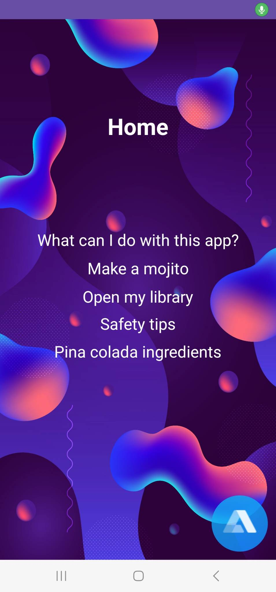
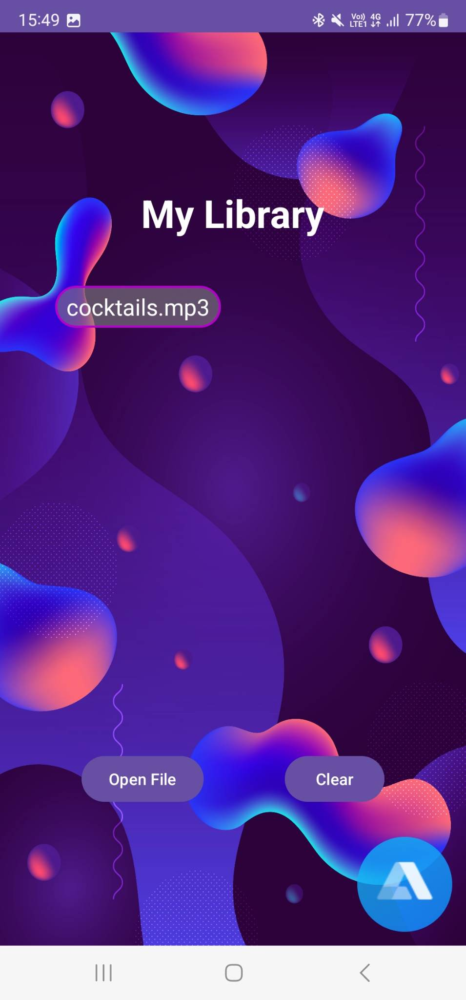
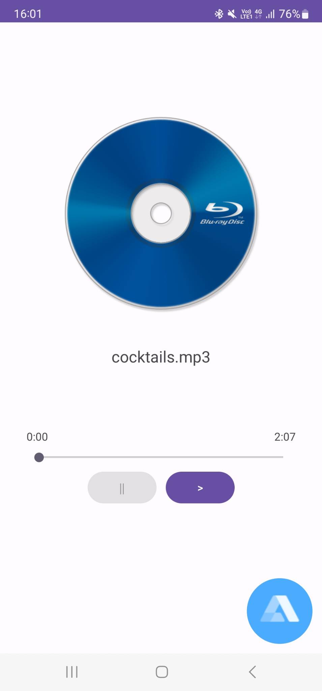

# Audio Based Workplace Learning App

## Pildid





## Projekti kirjeldus ja eesmärk

Projekti eesmärgiks on edastada juhendeid kasutajale erinevate toimingute kohta läbi heli, olgu selleks siis helifaili mängimine või läbi AI assistendi. Rakendus annab võimaluse esitada ja kuulata audiofaile hands-free, mis on suureks abiks tegevustel, kus on vaja kasutada mõlemat kätt või olla muudmoodi füüsiliselt hõivatud. Rakendus annab kasutajale 2 erinevat viisi, kuidas helilisi juhendeid vastu võtta. Nendeks on - läbi helifailide, mida saab rakendusse sisse laadida ja hiljem kuulata ning ka läbi häälkäskluste, mis on tehtud võimalikuks läbi Alan AI liidese, mis on avatud lähtekoodiga tarkvara.

Rakendus valmis TLÜ digitehnoloogiate instituudis tarkvaraarenduse suvepraktika tööna. Projekt on läbi viidud [AfriCHI 2023 4th African Human Computer Interaction Conference](https://africhi2023.org/) raames, mille tulemusena saab meie klient oma uurimistööd, millesse oleme panustanud oma rakenduse ja teemasisese teadustööga, sellel konverentsil, mis toimub 27. november - 01.detsember esitada.

## APK koostamine

1. Ava projekti kaust Android Studios.
2. Minge `Resource Manager > String` ja valige ülevalt vasakult nurgast + ikoon ja siis `String Resource File`, et lisada uus ressursi fail.
3. Pange faili nimeks `secrets` ja vajutage OK.
4. Selle faili sisu peaks nägema välja selline, kus `API_VÕTI` peaks asendama Alan AI API võtmega:
```xml
<?xml version="1.0" encoding="utf-8"?>
<resources>
    <string name="alan_api_key">API_VÕTI</string>
</resources>
```
5. Seejärel saab APK valmis koostada vajutades ülevalt `Build > Make Project`, või käima panna läbi `Run > Run 'app'`.

## Installatsioon

Kuna tegemist on Android seadme rakendusega ehk `APK`, siis fail ei ole sobilik iOS seadmetele (iPhone). Rakendus on sobilik järgnevate tootjate seadmetele: Samsung, Xiaomi, Huawei ja muud Android OS-i kasutavat nutiseadet. Tegemist on tavapärase telefoni rakenduse installimisega. Selleks tõmmata alla meie poolt pakutav `.apk` laiendiga fail. Seejärel see avada ning tuleb ette aken, et tegu on tundmatust allikast pärit rakendusega. Seal valida, et usaldate allikat ning installimise protsess viib ise kõik lõpule.

## Kasutatud tehnoloogiad

- Kotlin version 1.8.20
- JavaScript 2020 version 
- Audacity version 3.3
- Android Studio Flamingo | 2022.2.1 Patch 2
- Alan SDK  4.21.2
- Voiceflow
- NaturalReader

## Projekti autorid

Projekti autorid: Kevin-Kaspar Einsok, Sten-Kristjan Prantsu, Karl Joonas Berkovitch, Uku Kõressaar

Klient: Abiodun Afolayan Ogunyemi

## Litsents

Kasutuses on [MIT litsents](LICENSE).
